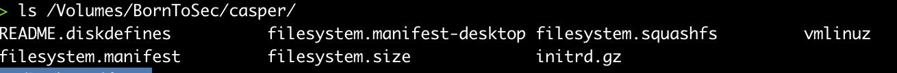
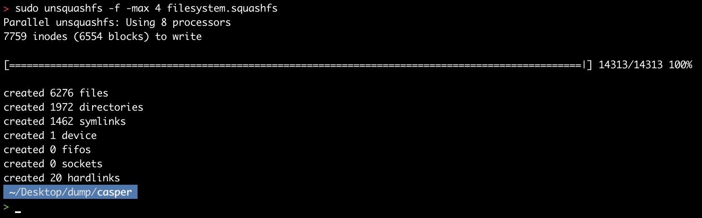
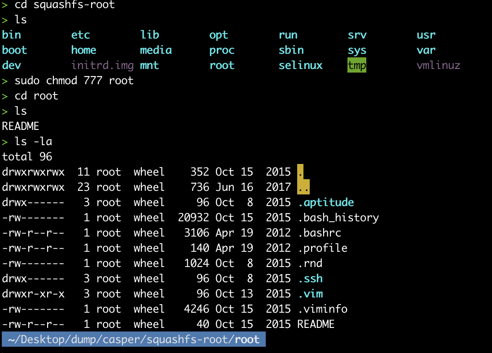
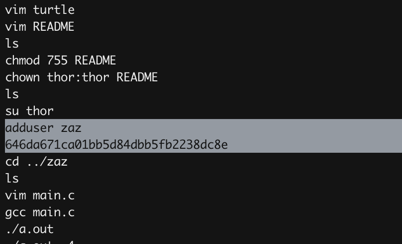

In real life scenario, if you get your hands on the custom recovery image of some company,
You extract the filesystem.squashfs with all permisions, then decrypt the passwords or search for dirt left by the sysadmin...,
In our case, we found zaz password in .bash_history of root user, what the root user was typing when he was customising the image.

Extrating filesystem.squashfs.

Explore root folder.

cat .bash_history

