##Writeup 1

After downloading and setting up the machine on VirtualBox, There isn't any visible IP address on startup like other ISOs to connect easily on SSH.
This is not a big deal, we will use nmap to scan all devices on our network and their open ports. We will not scan for all possible addresses in our network because that will take a long time. And since we already know the range of IPs we want to search for (10.13.100.0 to 10.13.100.256), we will use nmap with that range: (Otherwise we can use arp to get IPs addresses on the network then nmap to scan for open ports):

```console
nmap 10.13.100.0/24
```


That will show us the open ports, we notice that a host is up with open ports for ssh, ftp, *http* and *https*. That mean we can access it via our navigator
after that we use dirbuster to fuzz all available directories in the website:


We can access to the website but still we can't do much with a simple HTML page, let's try fuzzing directories with *dirb* to see if we can find any useful directory.
```console
dirb https://10.13.100.x
```

we find a /forum + other directories we will get to later
after scanning the posts in the forum, we find a thread from lmezard where there is a bunch of logs and errors, after a quick scan we can find a leaked pw : **!q\]Ej?\*5K5cy\*AJ**
we log in with lmezard:!q\]Ej?*5K5cy*AJ and we find her email we go to https://192.168.188.140/webmail/ we use the same pw
we will find identifiers to the database phpmyadmin root/Fg-'kKXBj87E:aJ$
we can inject a webshell using sql, but we'll need to find the directory where to put it, all directories will return an error except https://192.168.188.140/forum/templates_c/
now if we see what's inside /home we'll see a file called LOOKATME that contains : **lmezard:G!@M6f4Eatau{sF"**
this isn't working in ssh but first when we ran nmap we saw a port 21 open for ftp.
ftp 192.168.188.140
Name > lmezard
Password > G!@M6f4Eatau{sF"

we got in, let's try ls command, it doesn't work let's try passive mode
ftp > pass
ftp > ls
150 Here comes the directory listing.
-rwxr-x--- 1 1001 1001 96 Oct 15 2015 README
-rwxr-x--- 1 1001 1001 808960 Oct 08 2015 fun
226 Directory send OK.

we use mget to get the files to our working directory
mget README fun

t r e h I? a?

01 I
02 h
03 e
04 a
05 r
06 t
07 p
08 w
09 n
10 a
11 g
12 e

sha256(Iheartpwnage) = 330b845f32185747e4f8ca15d40ca59796035c89ea809fb5d30f4da83ecf45a4

ssh laurie@192.168.188.140
330b845f32185747e4f8ca15d40ca59796035c89ea809fb5d30f4da83ecf45a4

bomb:<br/>
1)Public speaking is very easy.<br/>
2)1 2 6 24 120 720 (factorial 1 to 6)<br/>
3)0 q 777<br/>
4)9 (fibonacci sequence of 55)<br/>
5)0x6f 0x70 0x65 0x6b 0x6d 0x61 = opekma (array123="isrveawhobpnutfg", newstr[i] = (&array.123)[(char)(*(byte *)(i + line) & 15)], it means each character & 0xf should equal the index in array123 so our newstr equals "giants" at the end)<br/>
6) 6 digits, must be under 7 and unique, starting with 4; the Function phase_6 use the input to sort 6 nodes, and then see if they are sorted in ascending order<br/>
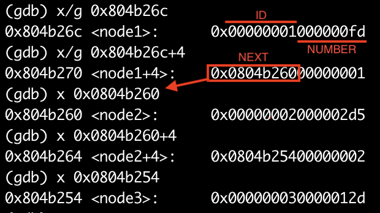
```
Public speaking is very easy.
1 2 6 24 120 720
0 q 777
9
opekma
4 2 6 3 1 5
```
> thor:Publicspeakingisveryeasy.126241207201b2149opekmq426135 [BUG IN THE SUBJECT](https://stackoverflow.com/c/42network/questions/664/1628?r=SearchResults&s=1%7C12.5313#1628)

We found a file named Turtle containing line like this:
```
Tourne gauche de 90 degrees
Avance 50 spaces
Avance 1 spaces
Tourne gauche de 1 degrees
```
that look like turtle logo algorithme, by changing those french word with actual instructions we got the password for zaz.
```
lt 90
fd 50
fd 1
lt 1
```
[TURTLE LINK](https://www.transum.org/Software/Logo/Level2/Default.asp?Level=3)

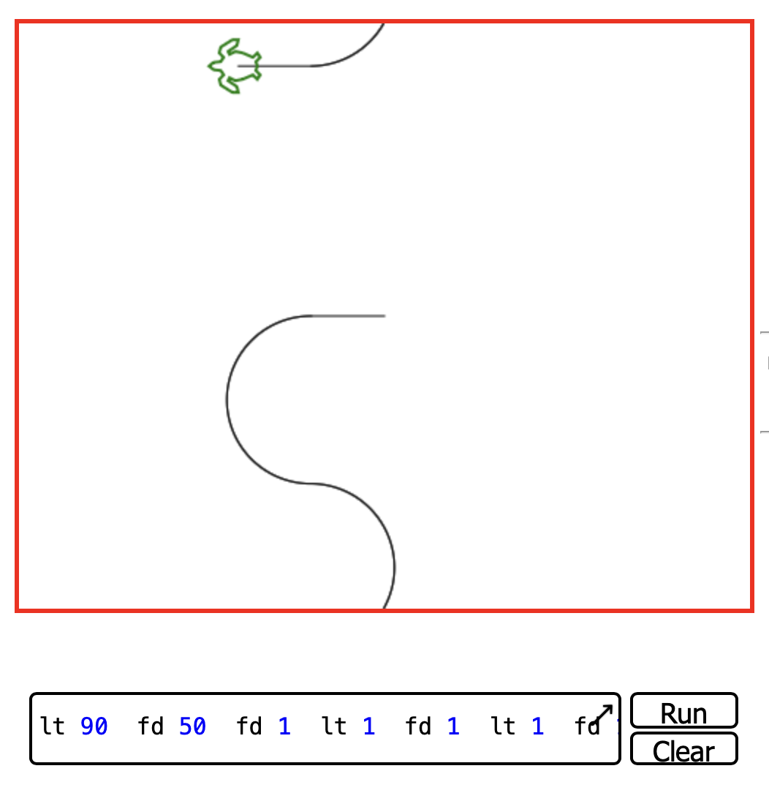
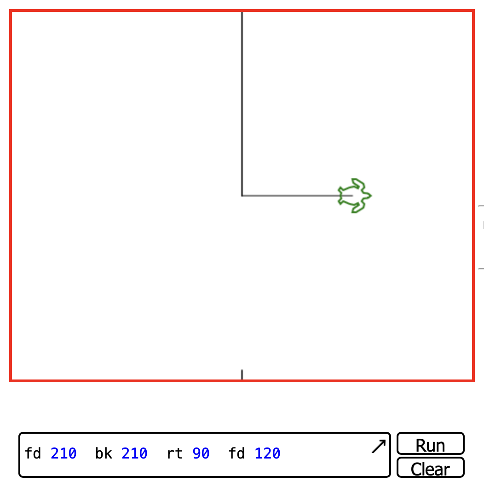
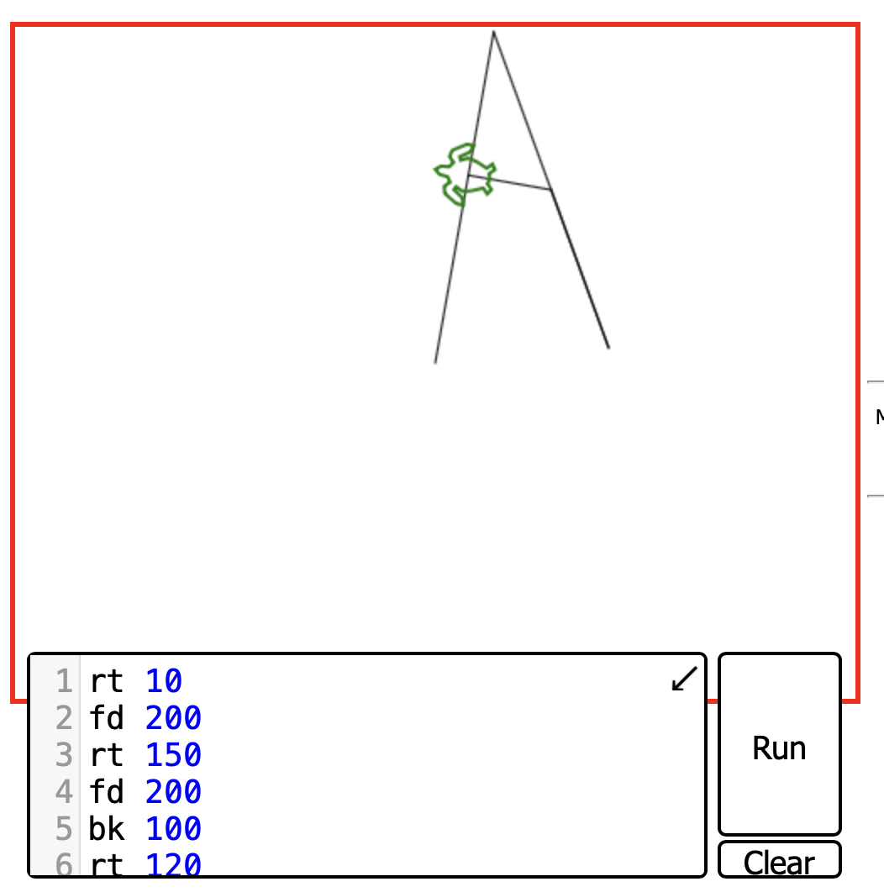
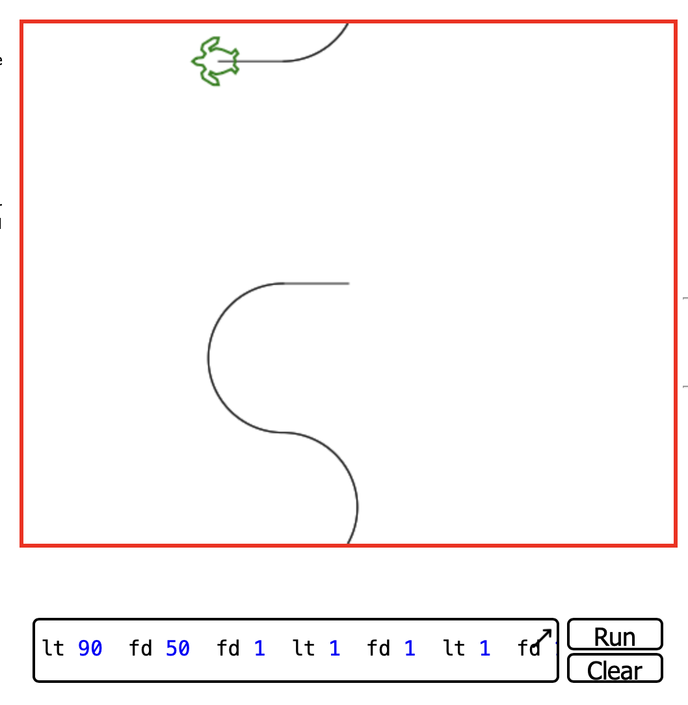
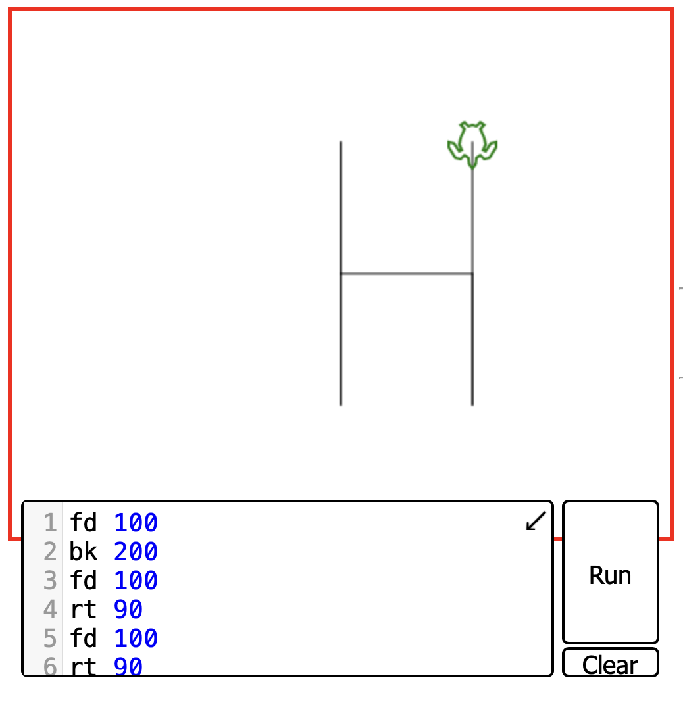

MD5 Hash of SLASH = 646da671ca01bb5d84dbb5fb2238dc8e

> zaz:646da671ca01bb5d84dbb5fb2238dc8e

We found an executable file named exploit_me, so we exploit it.
the program copy av[1] into a local variable using strcpy"NON SECURE" and then prints it using puts(&var), so we have a buffer overflow.<br/>
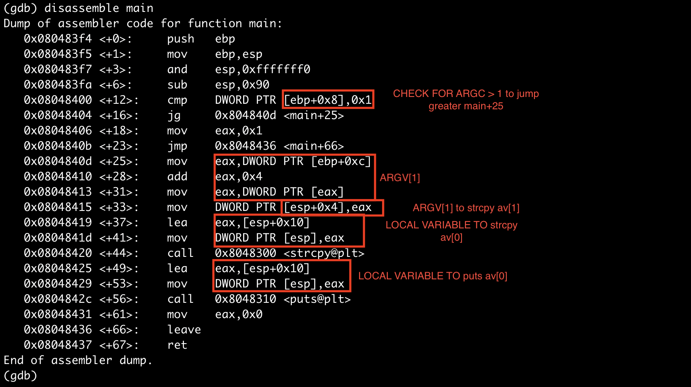

Now we have to find the lenght needed to overwrite the return address.<br/>
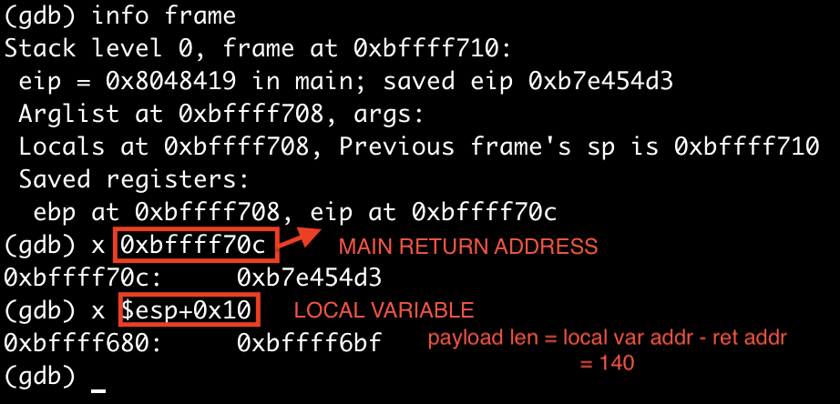

Test the lenght:<br/>

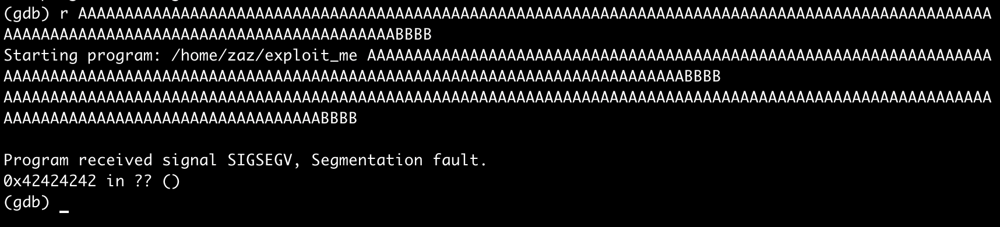

Now we need to inject a [shellcode](https://shell-storm.org/shellcode/files/shellcode-811.php) and redirect to it:<br/>
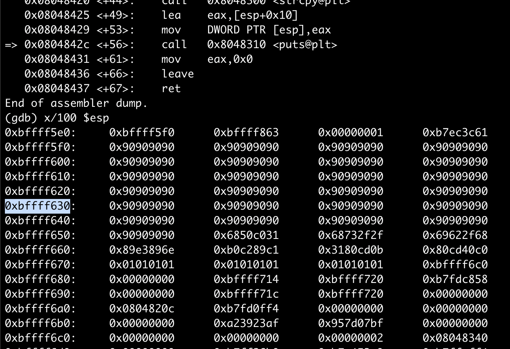
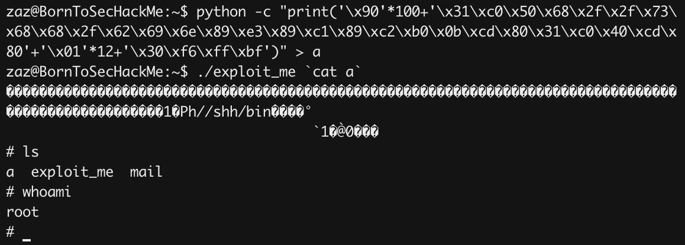


